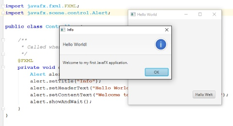

# Hello World mit IntelliJ und JavaFX

## Aufgabe 1
Installiere die Entwicklungsumgebung [IntelliJ IDEA](https://www.jetbrains.com/idea/) von Jetbrains. IntelliJ ist die optimale Entwicklungsumgebung für die Programmierung mit Java.
Du findest eine Installationsanleitung in dem Dokument [Einführung-IntelliJ.pdf](01_Einführung-IntelliJ.pdf). Da die Möglichkeiten, die IntelliJ bietet, sehr  umfangreich sind, werden in diesem Dokument auch die wichtigsten Elemente und ihre Verwendung beschrieben.

## Aufgabe 2
Erstelle nun deine erste JavaFX-Applikation.
Die Applikation soll eine Benutzeroberfläche, auf der ein Button platziert ist, am Bildschirm anzeigen. Wenn der Benutzer auf den Button klickt, soll eine Meldung (Dialogbox) "Hallo Welt" am Bildschirm ausgegeben werden.

### Hilfsmittel
Im Dokument [Anleitung-HelloWorld-mit-JavaFX.pdf](02_Anleitung-HelloWorld-mit-JavaFX.pdf) wird Schritt für Schritt erklärt, wie du die "Hello World" Applikation mit JavaFX erstellen kannst.