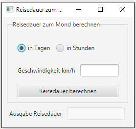

# Reisedauer zum Mond

## Aufgabe
Entwickle ein Programm, das für eine bestimmte durchschnittliche Geschwindigkeit die Reisedauer für die Reise von der Erde zum Mond bestimmt. 

Der Benutzer soll wählen können, ob die Reisedauer in Tagen oder Stunden ausgegeben werden soll. Dabei soll als Default-Einstellung die Option "in Tagen" ausgewählt sein.  

Erstelle zuerst im Scene Builder die Benutzeroberfläche. Du kannst Dich bei der Gestaltung am unten abgebildeten Beispiel-GUI orientieren.

### Benutzeroberfläche


##Hinweise
Die Distanz zwischen Mond und Erde variiert, da die Entfernung Erde-Mond schwankt. Der Mond dreht sich
nicht auf einer Kreisbahn um die Erde, sondern auf einer Ellipse (leicht eier-förmige Bahn). Für die vorliegende
Aufgabe kann die durchschnittliche Entfernung Erde-Mond verwendet werden.

###Beispielcode

Der folgende Code zeigt, wie geprüft werden kann, ob ein RadioButton aktiviert ist.
```Java
if (radioButtonDays.isSelected() == true) {
            // RadioButton ist aktiviert
        }
```
Der Sinn von RadioButtons ist es (im Gegensatz zu CheckBoxen), dass der Benutzer immer nur einen auf einmal selektieren kann. Hierzu müssen die RadioButtons gruppiert werden. Dies passiert bei JavaFX mittels der Eigenschaft _Toggle Group_.

##Zusatzaufgaben
### Zusatzaufgabe 1
Die berechnete Reisedauer soll auf zwei Kommastellen genau ausgegeben werden.
