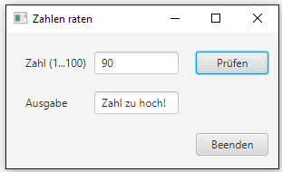

# Zahlen raten

## Aufgabe
Du entwickelst ein Programm, das bei Programmstart eine Zufallszahl zwischen 1 und 100 bestimmt. Der Benutzer soll diese Zahl erraten.

Der Benutzer kann eine Zahl raten, indem er diese in ein Textfeld eingibt und den Button "Prüfen" klickt. Das Programm gibt darauf hin aus einen Hinweis aus, ob der Benutzer richtig geraten hat:
- Zahl zu klein!
- Zahl zu gross!
- Zahl stimmt!

Der Benutzer kann so oft eine Zahl eingeben, bis er die richtige Zahl erraten hat.

### Benutzeroberfläche

## Hinweise
Die Zufallszahl soll gleich beim Start des Programms berechnet werden, z.B. im Konstruktor der Controller-Klasse.

## Zusatzaufgaben

###Zusatzaufgabe 1
Erweitere das Programm so, dass am Schluss die Anzahl Versuche angezeigt werden, die der Benutzer
benötigt hat, um die Zahl zu erraten.

###Zusatzaufgabe 2
Falls der Benutzer zum wiederholten Mal eine Zahl eingibt, soll er darüber informiert werden, dass er diese Zahl bereits früher schon einmal eingegeben hat.