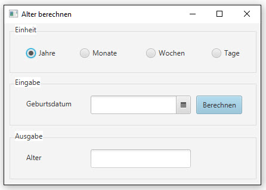
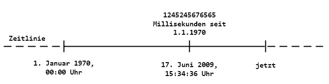

# Alter berechnen

## Aufgabe
Entwickle ein Programm, das anhand eines Geburtsdatums, das vom Benutzer eingegeben wird, das Alter berechnet:
- in Jahren
- in Monaten
- in Wochen
- in Tagen

Achte darauf, dass nur komplett abgelaufene Jahre/Monate zum Alter gezählt werden. Zum Beispiel wenn heute der 2. Oktober 2016 ist und als Geburtsdatum der 3. Oktober 2014 eingebeben wird, dann soll als Alter **1 Jahr** respektive **23 Monate** ausgebeben werden.

## Benutzeroberfläche


##Abnahmetests
Deine Applikation wird vom Kunden erst nach Bestehen der folgenden Tests abgenommen und bezahlt! 
```
GEGEBEN SEI    ich habe die Einheit "Tage" selektiert
               UND habe im Feld "Geburtsdatum" dasDatum von gestern eingegeben
WENN           ich den Button "Berechnen" anklicke
DANN           wird im Ausgabefeld als Resultat die Zahl 1 ausgegeben
```

```
GEGEBEN SEI    ich habe die Einheit "Wochen" selektiert
               UND habe im Feld "Geburtsdatum" das Datum von gestern eingegeben
WENN           ich den Button "Berechnen" anklicke
DANN           wird im Ausgabefeld als Resultat die Zahl 0 ausgegeben
```

```
GEGEBEN SEI    ich habe die Einheit "Monate" selektiert
               UND habe im Feld "Geburtsdatum" das Datum von morgen abzüglich eines Jahres eingegeben
WENN           ich den Button "Berechnen" anklicke
DANN           wird im Ausgabefeld als Resultat die Zahl 11 ausgegeben
```

```
GEGEBEN SEI    ich habe die Einheit "Jahre" selektiert
               UND habe im Feld "Geburtsdatum" das Datum von morgen abzüglich eines Jahres eingegeben
WENN           ich den Button "Berechnen" anklicke
DANN           wird im Ausgabefeld als Resultat die Zahl 0 ausgegeben
```

##Hinweise

###DatePicker
Für die Eingabe des Geburstdatums kannst Du das "DatePicker"-Control verwenden.

###java.time
Mit Java 8 wurde das Paket `java.time` eingeführt. Du bist gut beraten, wenn Du die Klassen aus diesem Paket benutzt, wenn immer du mit Datum und Zeit zu tun hast; denn diese neue Date-Time API vereinfacht das Rechnen mit Datum und Uhrzeit im Vergleich zur alten API (java.util.date) sehr.

Zeit wird in Java im Grundsatz durch eine Zahl repräsentiert, welche die Anzahl Millisekunden seit dem 1. Januar 1970, 00:00 Uhr widerspiegelt. Das kannst Du Dir in etwa wie unten abgebildet vorstellen.


In der neuen Date-Time API repräsentiert die Klasse `java.time.Instant` einen genauen Zeitpunkt auf der Zeitlinie.

```java
Instant instant = Instant.now();
System.out.println(instant.toEpochMilli());  // Millisekunden seit 01.01.1970 00:00 Uhr
```

Manchmal wirst du die Information, die die Zeitlinie liefert, gar nicht brauchen, sondern nur ein **einzelnes Datum** oder eine **bestimmte Uhrzeit**. Für solche Zwecke gibt es in der neuen API drei verschiedene Klassen:
- `java.time.LocalDate`
- `java.time.LocalTime`
- `java.time.LocalDateTime`

```java
LocalDate today = LocalDate.now();
System.out.println(today);  // 2016-10-02 (gegeben heute sei der 2. Oktober 2016)
```

**Weitere Informationen und Hilfe zur neuen Java Date-Time API findest Du im Internet, z.B. in der [Java-Referenz](https://docs.oracle.com/javase/8/docs/api/java/time/package-summary.html).**

