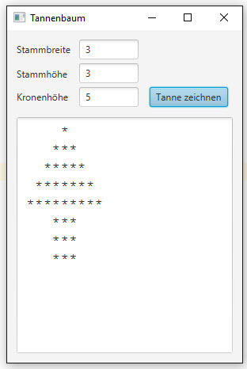

# Fläche eines Rechtecks berechnen

## Aufgabe
Schreibe ein Programm, das einen Tannenbaum auf den Bildschirm zeichnet. Implementiere dazu eine Klasse _Tanne_. Statte die Klasse mit den Eigenschaften _Stammbreite_, _Stammhoehe_ und _Kronenhoehe_ aus und programmiere sie so, dass sie wie folgt verwendet werden kann:
```Java
Tanne t = new Tanne();
t.setStammbreite(3);   // setzt Stammbreite in der Tanne t
t.setStammhoehe(3);    // setzt Stammhoehe in der Tanne t
t.setKronenhoehe(5);   // setzt die Kronenhoehe in der Tanne t
t.zeichne();		   // zeichnet Tanne t und stellt Resultat bereit
textAreaResult.setText(t.getZeichnung());  // fertige Zeichnung abholen und in ein TextArea-Control abfüllen
```

Die Höhe und die Breite des Tannenbaums (sowohl Baumstamm als auch Krone) sollen vom Benutzer eingegeben werden können. 
### Benutzeroberfläche


##Zusatzaufgaben

### Zusatzaufgabe 1
Erweitere die Klasse Tanne so, dass die Kronenhöhe, die Stammhöhe und die Stammbreite gleich beim
Konstruieren des Objekts gesetzt werden damit Anweisungen für das Zeichnen einer Tanne wie folgt erfolgen
kann.

```Java
Tanne t = new Tanne(3, 3, 5);
t.zeichne();
textAreaResult.setText(t.getZeichnung());
```

### Zusatzaufgabe 2
Validiere die Eingaben des Benutzers. Es gibt mehrere Möglichkeiten dies zu tun:
+ während der Eingabe (Zeichen verbieten)
+ nach der Eingabe (Fehlermeldung)
+ Eingabe mittels spezieller Controls (Slider, Numberstep, Button mit Wert, u.ä.)

Du sollst die erste Variante anwenden. Sorge dafür, dass jede Textbox (Stammbreite, Stammhöhe und Kronenhöhe) **nur Zahlen** akzeptiert, das heisst, der Benutzer soll keine Buchstaben und/oder Sonderzeichen eingeben können.
