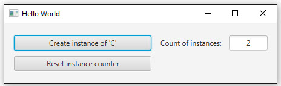

# Instanzenzähler

## Aufgabe
Nehme einmal an, jemand möchte wissen, wie viele Objekte einer bestimmten Klasse C im Laufe eines Programms erzeugt werden.

Implementiere die Klasse C, so, dass sie die Instanzen von sich selber zählt. Versehe sie dazu mit einer statischen Zählervariablen sowie mit einer statischen Methode, mit der die Zählervariable zurückgesetzt werden kann. Wo muss die Zählervariable erhöht werden?

###Benutzeroberfläche
