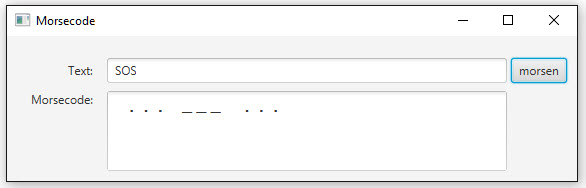

# Morsecode

## Aufgabe
Schreigbe ein Programm, das einen Text ins Morsealphabet umwandelt. Der Anwender soll den Text selbst eingeben können.  

Erstelle eine Klasse _MorseCode_ und implementiere darin eine Methode, die den vom Benutzer eingegebenen Text entgegennimmt, verarbeitet und den Morsecode zurückgibt.
```Java
public String getMorseCode(String text)
```
Morse-Symbole werden mit Punkt (·) bzw. Minuszeichen (-) dargestellt. Zwischen zwei Buchstaben soll ein Leerzeichen (“ “), zwischen zwei Wörtern sollen drei Leerzeichen (“   “) stehen. Das Morse-Alphabet findest Du bei Wikipedia:
- [http://de.wikipedia.org/wiki/Morsecode](http://de.wikipedia.org/wiki/Morsecode)


### Benutzeroberfläche
Um die Klasse testen zu können, wird ein JavaFX-GUI erstellt, bspw. wie folgt:


