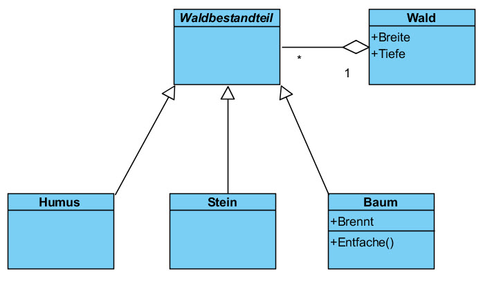
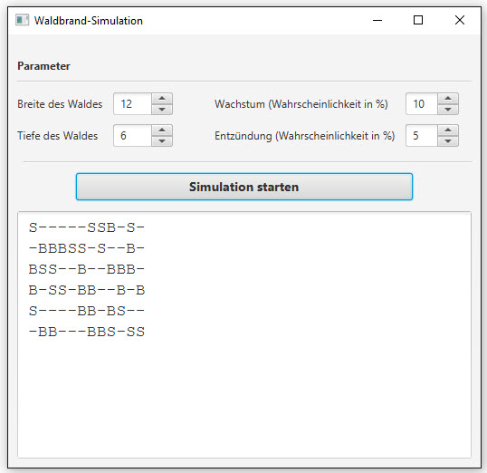

# Waldbrand

## Aufgabe

Dein Programm soll einen Waldbrand simulieren. Zunächst besteht der Wald aus einem rechteckigen Raster (zweidimensionales Feld) aus Bäumen (B), Steinen (S) und leerem Waldboden (-). Die Verteilung, d.h. wo ein Baum, wo ein Stein und wo leerer Waldboden platziert wird, passiert zufällig, wenn der Wald erstellt wird.
Nach Start der Simulation geschieht über einen Timer gesteuert in jedem Zeitschritt _t_ folgendes:

- Jeder Baum wird sich mit einer kleinen Wahrscheinlichkeit von _f_ entzünden (Funken, Blitze, weggeworfene Zigarettenstummel, etc.). Brennende Bäume werden mit dem Buchstaben F (Feuer) bezeichnet.

- Jeder Baum (B), der einen brennenden Nachbarn (F) hat, wird in jedem Fall auch zu brennen beginnen (F). Jedoch können  Bäume, die im Zeitschritt _t_ zu brennen beginnen, erst im nächsten Zeitschritt (_t + 1_) die umliegenden Bäume entfachen.

- Jeder brennende Baum (F) verglüht, sobald er die umliegenden Bäume entfacht hat.

- Verglühte Bäume (f) werden schliesslich zu einem leeren Stück Waldboden und damit zu Humus (-).

- Auf jedem leeren Stück Waldboden, respektive Humus (-) wird mit einer geringen Wahrscheinlichkeit _w_ ein neuer Baum (B) wachsen.

- Steine (S) können nicht brennen und an deren Stelle wird auch nie ein neues Bäumchen (B) keimen.

Bevor er die Simulation startet, soll der Benutzer die Wahrscheinlichkeiten _f_ (Funkenentzündung) und _w_ (Wachstum) sowie die Breite und die Tiefe des Waldes eingeben können. Nach jedem Zeitschritt wird der Wald neu gezeichnet. Dies kann der Einfachheit halber in einenm TextArea-Control geschehen (siehe Benutzeroberfläche).

### Analyse-Klassendiagramm

Das Analyse-Klassendiagramm für diese Aufgabe zeigt die folgende Situation. Orientiere dich bei der Implementation der Lösung an diesem Klassendiagramm.

### Benutzeroberfläche

## Zusatzaufgabe
Verwende anstelle der Zeichen "B", "F", "f", "S" und "-" Farben, um den Wald zu visualisieren: 
- Bäume: grün
- brennende Bäume: rot
- verglühte Bäume: orange
- Steine: grau
- Humus: braun

