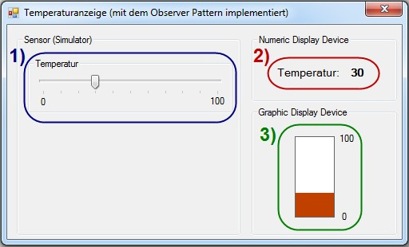
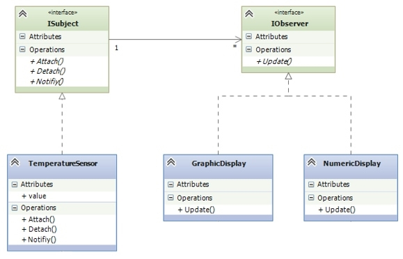
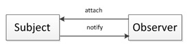
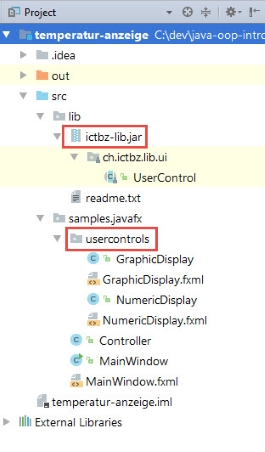
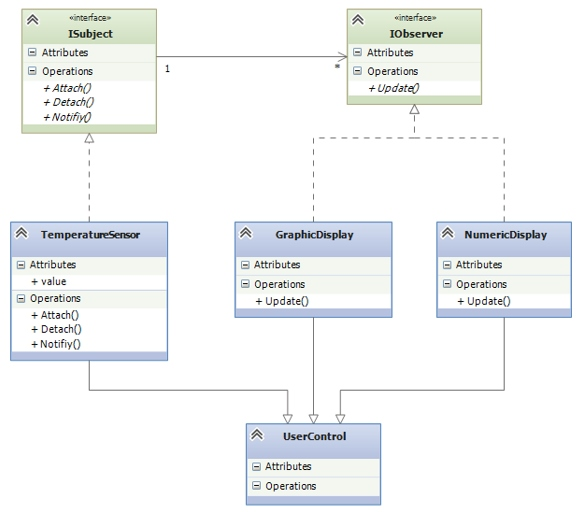

# Temperaturanzeige

## Aufgabe

Programmiere eine Temperaturanzeige, die aus den folgenden Komponenten besteht:

1.	**Temperatur Sensor** (blau): Ein _Custom Control_, welches einen Sensor simuliert (Veränderung der Temperatur via Schieberegler innerhalb eines Bereichs von 0 bis 50°)
2.	**Numerisches Display** (rot): Ein _Custom Control_, welches die vom Sensor gemeldete Temperatur numerisch anzeigt.
3.	**Graphisches Display** (grün): Ein _Custom Control_, welches die vom Sensor gemeldete Temperatur graphisch anzeigt.

###Observer Pattern
Implementiere die Temperaturanzeige gemäss dem sogenannten [Observer Pattern](https://en.wikipedia.org/wiki/Observer_pattern) **ohne Events und Delegates** zu benützen. Verwende ein Interface _ISubject_ welches vom Subject implementiert wird und ein Interface _IObserver_ für die Observer. Daraus ergibt sich folgendes Klassendiagramm:

####Hinweise
Wenn immer die Temperatur ändert, benachrichtigt der Sensor die Displays, die daraufhin ihre Anzeige anpassen.

Wenn Objekte (Observer = Beobachter) an Status-Änderungen von anderen Objekten (Subject) interessiert sind, können sie sich bei diesen Objekten registrieren, um bei Änderungen benachrichtigt zu werden.

**Das Subject**
-	kennt seine Observer
-	benachrichtigt die Observer bei Status-Änderungen
-	besitzt ein Interface zum Registrieren und Abmelden von Observern

**Der Observer**
-	besitzt ein Interface mit einer Methode, über die er bei Status-Änderungen vom Subject eine Meldung erhält

Verwende in der konkreten Subject-Klasse eine Liste, um die Referenzen auf die registrierten Observer zu speichern.

###Custom Controls
Die Klassen _TemperatureSensor_, _GraphicDisplay_ und _NumericDisplay_ sollen als **Custom Control** implementiert werden. Custom Controls bestehen in der Regel aus mehreren bereits exisitierenden Controls. Zum Beispiel kann der  _TemperatureSensor_  aus einem Rahmen (_Rectangle_) mit Title (_Label_) sowie einem _Slider_ und zwei weiteren Labels für die Anzeige der minimalen respektive maximalen Temperatur gebaut werden.

Hilfe und Anleitungen zur Erstellung von JavaFX Custom Controls findest du im Internet.

####Die schnell(ere) Tour
**Vorbereitetes IntelliJ-Projekt**
Falls dir die Zeit fehlt, um dich in die Erstellung von Custom Controls einzulesen, kannst du ein vorbereitetes IntelliJ-Projekt verwenden, in welchem die beiden Klassen _GraphicDisplay_ und _NumericDisplay_ bereits existieren (im Package "samples.javafx.usercontrols").

Das vorbereitete Projekt ist im Git-Repo mit dem Tag ``Version-mit-UserControl`` versehen (-> git checkout).

**Klasse _UserControl_**
Das vorbereitete IntelliJ-Projekt referenziert eine jar-Library (ictbz-lib.jar). Diese Library beinhaltet die abstrakte Klasse _UserControl_, von  der die Klassen _GraphicDisplay_ und _NumericDisplay_ abgeleitet sind. Die Klasse _TemperatureSensor_ kannst du analog der beiden Observer-Klassen implementieren.

**Komplettes Klassendiagramm (inkl. UserControl)** 

