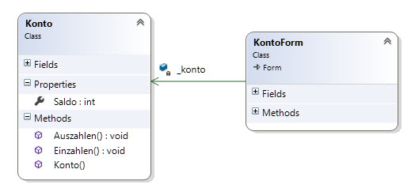
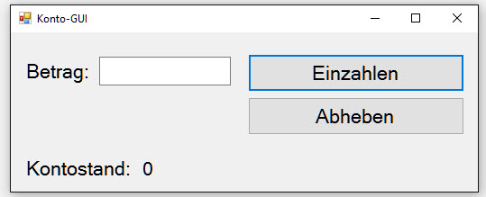

#Demo: KontoSample

## Beschreibung
Anhand der unten abgebildeten Klasse `Konto` wird gezeigt, was Eigenschaften und Methoden sind. An diesem Beispiel wird auch das Konzept der "Kapselung" konkret sichtbar, indem der Saldo vor Zugriff von aussen geschützt wird. Eine Veränderung des Saldos ist nur kontrolliert möglich, über die entsprechenden Methoden _Einzahlen_ und _Auszahlen_.

### Klassendiagramm


### GUI


## Vorgehen
Für die Demo kann die VS-Solution im Verzeichnis "Ausgangslage" verwendet werden. Darin vorbereitet befindet sich das GUI.

Es kann wie folgt vorgegangen werden.

Klasse _Konto_ erstellen mit einem privaten Feld _ _saldo_ das gekapselt wird als Eigenschaft _Saldo_ (`get` und `set` implementieren)

Im Formular ein privates Feld vom Typ _Konto_ erstellen, instanziieren mit dem Schlüsselwort `new`.

In den Event-Handlern der Buttons "Einzahlen" und "Auszahlen" den Kontostand erhöhen respektive verringern (neuer Kontostand dann unten im entsprechenden Feld ausgeben, damit er visuell kontrolliert werden kann)

**Problem**: Der Benutzer kann soviel abheben wie er will, unser Programm hat keine Kontrolle darüber! Was tun?

Diskussion: Wir wollen dafür sorgen, dass der Kontostand nicht ins Minus rutschen kann -> wie machen wir das am besten?

**Lösung**: Den Saldo kapseln, d.h. die Eigenschaft Saldo vor Schreibzugriff schützen (`private set`), Programmierung der Methoden `Einzahlen()` und `Auszahlen()` und innerhalb der Methode `Auszahlen` eine Prüfung implementieren und falls zuviel abgehoben wird, einen Fehler werfen.

```Java
/// <summary>
/// Gibt den aktuellen Kontostand zurück.
/// </summary>
public int Saldo 
{
    get { return _saldo; }
    private set { _saldo = value; }
}
/// <summary>
/// Diese Methode erhöht den Saldo um einen bestimmten Betrag.
/// </summary>
/// <param name="betrag">Der Einzahlungsbetrag</param>
public void Einzahlen(int betrag) 
{
	_saldo += betrag;
}

/// <summary>
/// Diese Methode reduziert den Saldo um einen bestimmten Betrag.
/// Falls der Saldo ins Minus fallen würde, wird ein Fehler (nicht erlaubt) "geworfen".
/// </summary>
/// <param name="betrag">Der Auszahlungsbetrag</param>
public void Auszahlen(int betrag)
{
    if (_saldo < betrag)
        throw new Exception("Nicht erlaubt! Der Saldo darf nicht im Minus sein!");
    _saldo -= betrag;
}
```

Die Klasse Konto hat nun volle Kontrolle über "ihren" Saldo.