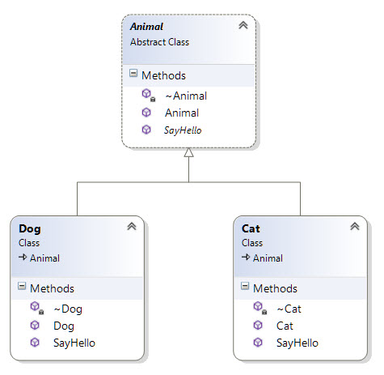
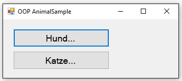

#Demo: AnimalSample

## Beschreibung
Anhand der unten abgebildeten Klassen werden die objektorientierten Konzepte der Vererbung und der Polymorphie demonstriert.

### Klassendiagramm


### GUI


## Vorgehen
Für die Demo kann die VS-Solution im Verzeichnis "Ausgangslage" verwendet werden. Darin vorbereitet befindet sich das GUI.

Danach kann die Demo - Schritt für Schritt - wie folgt ablaufen.

Eine abstrakte Klasse _Animal_ erstellen mit einer abstrakten Methode _SayHello()_.
```Java
/// <summary>
/// Abstract means: you can't create an instance of this class.
/// </summary>
public abstract class Animal {
	// // Abstract means: must be implemented in child class(es)
    public abstract void SayHello();
 }
```
Klasse _Cat_ erstellen, die von Animal erbt und darin die Methode _SayHello()_ überschreiben.
```Java
 public override void SayHello() {
 	MessageBox.Show("Miau!");
 }
```
Klasse _Dog_ erstellen, die von Animal erbt und darin die Methode _SayHello()_ überschreiben.
```Java
 public override void SayHello() {
 	MessageBox.Show("Wuff!");
 }
```
In jeder der drei erstellten Klassen kann im Konstruktor Logik implementiert werden, um  eine Meldung (MessageBox -> dazu Namespace _System.Windows.Forms_ einbinden) auszugeben, dass das betreffende Tier eben geboren wurde. Damit kann demonstriert werden, dass nach Instanzierung einer Klasse mit dem Schlüsselwort `new` immer sämtliche Konstruktoren entlang der Vererbungshierarchie aufgerufen werden. D.h. wenn ein _Dog_ instanziert wird, wird immer auch ein _Animal_ instanziert.
```Java
public Animal() {
	MessageBox.Show("An animal was born.");
}
public Cat() {
    MessageBox.Show("A cat was born.");
}
public Dog() {
    MessageBox.Show("A dog was born.");
}
```
Nun können die Eventhandler hinter den Buttons im GUI ausprogrammiert werden: Instanzieren eines neuen Hundes respektive einer neuen Katze und dann jeweils Aufruf der Methode _SayHello()_. Welche Messages erwarten wir?  Und in welcher Reihenfolge?

###Polymorphie
Um polymorphes Verhalten respektive "Late Binding" zu demonstrieren, kann im GUI-Formular eine Methode _Greet()_ implementiert werden, die als Parameter ein Objekt vom Typ _Animal_ nimmt. Darin dann die Methode _SayHello()_ auf dem _Animal_ Objekt aufrufen.
```Java
private void Greet(Animal a) {
	// Sagt hier ein Hund oder eine Katze "Hallo"? Nun, das wissen wir erst zur Laufzeit... (late binding).
    a.SayHello();
}
```


