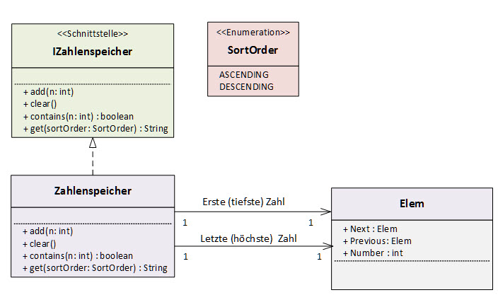

# Zahlenspeicher als dynamisch verkette Liste implementiert

## Aufgabe
Programmiere eine Klasse _Zahlenspeicher_, mit der Du eine beliebige Anzahl von Ganzzahlen speichern kannst.

Die Klasse soll folgende Schnittstelle _IZahlenspeicher_ implementieren.

```Java
public interface IZahlenspeicher {
    /**
     * Fügt eine Zahl in den Zahlenspeicher ein.
     * @param n
     */
    void add(int n);

    /**
     * Gibt true zurück, wenn die Zahl n im Zahlenspeicher vorhanden ist.
     * @param n
     * @return
     */
    boolean contains(int n);

    /**
     * Gibt alle Zahlen des Zahlenspeichers in einem Array zurück,
     * und zwar sortiert in der gewünschten Reihenfolge.
     * @param sortOrder
     * @return
     */
    String get(SortOrder sortOrder);

    /**
     * Löscht alle Zahlen aus dem Zahlenspeicher.
     */
    void clear();
}
```

Die Methode _get()_ soll die eingegebenen Zahlen **sortiert** als String zurückgeben. Die Zahlen sollen dabei durch ein Komma getrennt werden, so dass die aufsteigend sortierte Ausgabe nach Eingabe der Zahlen 5 und 2 und 8 und 1 wie folgt aussieht: „1, 2, 5, 8“. 
Die Enumeration für die Angabe der Sortierreihenfolge kannst Du wie folgt implementieren:
```Java
public enum SortOrder {
    ASCENDING,
    DESCENDING
}


```

### Benutzeroberfläche
Um die Klasse testen zu können, soll ein JavaFX-GUI erstellt werden, bspw. wie folgt:


###Hinweis
Es dürfen **keine** Klassen aus dem `java.util` Package verwendet werden! 
Da der Zahlenspeicher dynamisch wachsen soll und eine Sortierung möglich sein muss, wird sich eine Implementation mit einem `int[]` Array relativ umständlich gestalten (wenngleich es nicht unmöglich ist). Es empfiehlt sich darum, eine verkettete Liste zu implementieren. Eine (doppelt) verkettete Liste kann z.B. durch Implementation des untenstehenden Klassendiagramms erreicht werden. Die Verkettung der Elemente erfolgt dabei über die Attribute _Previous_ und _Next_ der Klasse _Elem_.



## Zusatzaufgabe: Generische Liste
Implementiere den Zahlenspeicher als eine (doppelt) verkettete und **generische** Liste. Da die Liste sortierbar sein soll, muss sichergestellt werden, dass nur Objekte in die Liste eingefügt werden können, die man sortieren kann. Schränke also den generischen Parametertyp auf Klassen ein, welche die Schnittstelle _Comparable<T>_ implementieren. 
Mehr Informationen zu generischen Typen und dem _Comparable_-Interface findest Du im Internet.