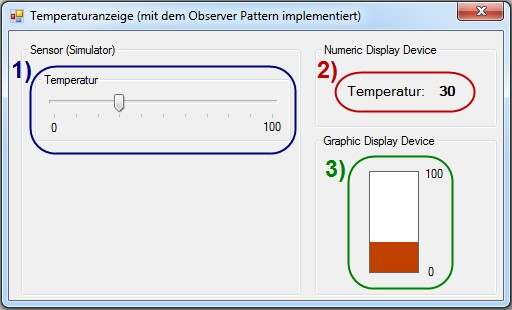

# Fläche eines Rechtecks berechnen

## Aufgabe
Entwickle ein JavaFX-Programm, mit dem die Fläche eines Rechteckes berechnet werden kann. Das Rechteck ist definiert durch Breite und Höhe, die vom Benutzer eingegeben werden. Der Button "Beenden" soll das Programm schliessen.

Erstelle die unten abgebildete Benutzeroberfläche. Verwende dazu die Steuerelemente (Controls) "Label", "TextField" und "Button".

Programmiere danach die Programmlogik innerhalb einer Controller-Klasse und gib das Resultat im dafür vorgesehenen Textfeld aus. Behandle dazu das _On Action_ Ereignis der beiden Buttons. 

### Benutzeroberfläche


## Hinweise
Um innerhalb der Controller-Klasse auf die Controls der fxml-Datei zugreifen zu können, musst Du die Textfelder als private Felder deklarieren (8-ung: @FXML-Annotation nicht vergessen!)

Die Verknüpfung der im Java-Code deklarierten Felder mit der fxml-Datei erfolgt über die Vergabe der fx:id im Scene Builder [(siehe auch: Connecting SceneBuilder edited FXML to Java code )](https://blogs.oracle.com/jmxetc/entry/connecting_scenebuilder_edited_fxml_to)
Achte darauf, dass Du immer die javafx imports verwendest, NICHT awt oder swing!

Folgender Code zeigt, wie der Text, den ein Benutzer in ein Textfield eingegeben hat, in eine Variable namens
„eingabe“ ausgelesen wird und wie der ausgelesene Text, der vom Typ String ist, in den Typ int konvertiert wird.
```Java
   String eingabe = textFieldBreite.getText();
   int breite = Integer.parseInt(eingabe);
```

##Zusatzaufgaben

### Zusatzaufgabe 1
Sorge dafür, dass der Benutzer im Ausgabefeld keinen Text eingeben kann.

### Zusatzaufgabe 2
Das Programm soll erkennen, wenn entweder das Feld "Breite" oder das Feld "Länge" leer ist und dem Benutzer mittels eines Alert-Dialoges [(javafx.scene.control.Alert)](https://docs.oracle.com/javase/8/javafx/api/javafx/scene/control/Alert.html) eine entsprechende Fehlermeldung ausgeben.

### Zusatzaufgabe 3
Das Programm soll auch erkennen, wenn der Benutzer eine ungültige Eingabe macht, also z.B. einen Text eingibt statt einer Zahl. In diesem Fall soll der Benutzer mit der Mitteilung "Bitte geben Sie eine Zahl ein." auf seine Falscheingabe hingewiesen werden.