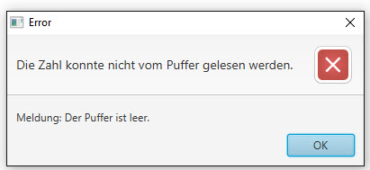

# FIFO Puffer

## Aufgabe
Programmiere eine Daten-Puffer Klasse namens _FifoPuffer_ mit den Methoden put() und get().
- `put()` -> schreibt Zahlen in den Puffer
- `get()` -> liest die Zahlen nach dem “first in first out”- Prinzip (FIFO) wieder aus dem Puffer aus

Bei Instanzierung des Puffers soll die Grösse des Puffers bestimmt werden können. Die Methoden
Die Methoden put() und get() sollen  sicherstellen, dass sowohl keine Zahl in einen vollen Puffer geschrieben, als auch keine Zahl aus einem leeren Puffer gelesen werden kann; es ist eine entsprechende Mitteilung auszugegeben, falls der Puffer voll respektive leer ist

Die Klasse FifoPuffer soll ausserdem über eine Methode `getAll()` verfügen, die alle sich im Puffer befindlichen Zahlen in der Reihenfolge, wie sie in den Puffer geschrieben worden sind und mit einem Komma getrennt als String zurück gibt.

Nachfolgender Code zeigt beispielhaft die Verwendung der Puffer-Klasse.

```Java
FifoPuffer p = new FifoPuffer (2); // Instanzierung des Puffers, Grösse 2
int i;
i = p.get(); // Fehler: Puffer leer
p.put(1);    // 1 geht in Puffer
p.put(2);    // 2 geht in Puffer
p.put(3);    // Fehler: Puffer voll
i = p.get(); // i=1
p.put(4);    // 4 geht in Puffer
```

### Benutzeroberfläche
Um die FifoPuffer-Klasse zu testen, soll ein JavaFX-GUI erstellt werden, bspw. wie folgt:


####Fehlermeldung "Puffer voll"


####Fehlermeldung "Puffer leer"



###Hinweis
Es dürfen **keine** Klassen aus dem `java.util` Package verwendet werden!